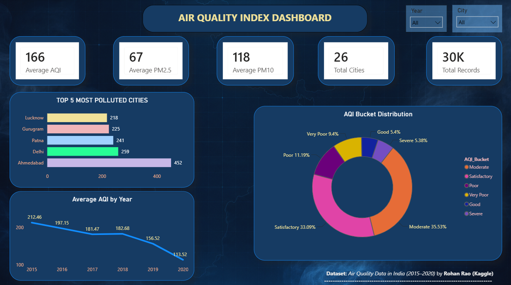
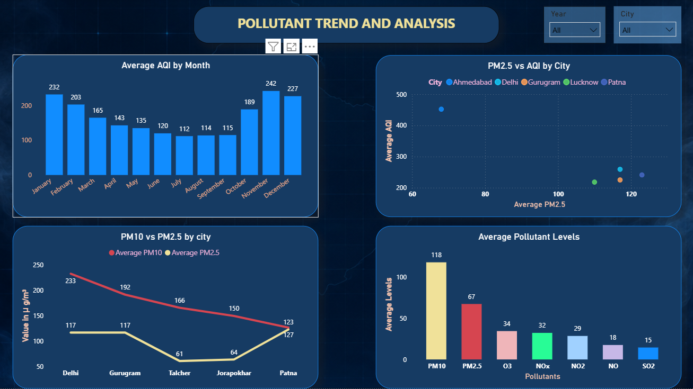
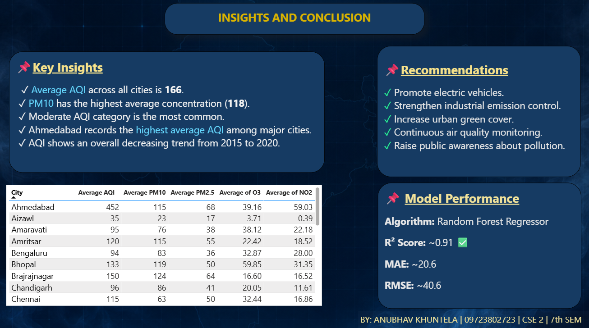

# Air-Quality-Analysis-and-Prediction-System-using-Machine-Learning-and-Power-BI
An end-to-end Air Quality Index (AQI) Prediction and Analysis project using Machine Learning and Power BI. The project predicts AQI using Random Forest Regression and provides an interactive dashboard for air quality analysis.

# Air Quality Index Prediction and Analysis using Machine Learning and Power BI

## Overview

This project presents a complete Air Quality Index (AQI) Analysis and Prediction System developed using Machine Learning and Microsoft Power BI.

The project performs data preprocessing, exploratory data analysis (EDA), AQI prediction using Machine Learning algorithms, and interactive dashboard visualization.

---

## Objectives

- Analyze air quality data from different Indian cities.
- Perform Exploratory Data Analysis (EDA).
- Predict Air Quality Index (AQI) using Machine Learning.
- Compare multiple regression models.
- Visualize AQI trends using Power BI.
- Provide meaningful insights and recommendations.

---

## Dataset

- **Dataset:** Air Quality Data in India (2015–2020)
- **Source:** Kaggle
- **File Used:** city_day.csv
- **Author:** Rohan Rao

---

## Technologies Used

- Python
- Jupyter Notebook
- Power BI
- Pandas
- NumPy
- Matplotlib
- Seaborn
- Scikit-learn
- Joblib

---

## Machine Learning Models

- Decision Tree Regressor
- Random Forest Regressor
- Extra Trees Regressor
- Gradient Boosting Regressor

Random Forest achieved the best performance with an **R² Score of approximately 0.91**.

---

## Power BI Dashboard

### Dashboard Overview

### Page 1

### Page 2

### Page 3

---

## Results

- Best Model: Random Forest Regressor
- R² Score: ~0.91
- MAE: ~20.6
- RMSE: ~40.6

---

## Future Scope

- Real-time AQI prediction
- IoT sensor integration
- Weather data integration
- Web application deployment
- Cloud deployment
- Live Power BI dashboard

---

## Author

**Anubhav Khuntela**

B.Tech Computer Science Engineering

Guru Tegh Bahadur 4th Centenary Engineering College
